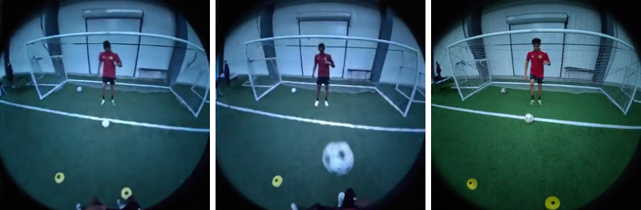

# EgoX Model Inventory & Quantization Notes

Complete list of models the EgoX reproduction depends on, plus the 24 GB / GGUF /
quantization analysis.

## 1. Generation stack (inference + training)

All Wan subcomponents ship **inside one snapshot** — `Wan-AI/Wan2.1-I2V-14B-480P-Diffusers`
(the **480P**, **-Diffusers**, **I2V** variant — all three qualifiers matter). Loaded as
subfolders ([core/finetune/models/wan_i2v/sft_trainer.py:99-105](EgoX/core/finetune/models/wan_i2v/sft_trainer.py#L99-L105)):

| Component | Class | Role | ~Size |
|---|---|---|---|
| `transformer` | `WanTransformer3DModel` → EgoX `_GGA` subclass | 14B diffusion backbone | ~28 GB (bf16) |
| `text_encoder` | `UMT5EncoderModel` (umt5-xxl) | text → conditioning | ~11 GB |
| `image_encoder` | `CLIPVisionModel` (CLIP ViT-H) | I2V image conditioning | ~2–4 GB |
| `vae` | `AutoencoderKLWan` | latent encode/decode | ~1 GB |
| tokenizer / image_processor / scheduler | — | no weights | negligible |
| **Full Wan snapshot** | | | **~60–70 GB** |

Plus the EgoX adapter (separate download):

| Model | Repo / file | Role | ~Size |
|---|---|---|---|
| **EgoX LoRA** | `DAVIAN-Robotics/EgoX` → `pytorch_lora_weights.safetensors` | rank-256 LoRA fused onto transformer | ~0.1–1 GB |

Same base for **both training and inference** — there is no separate "training variant" of
the Wan model. What is training-specific is the LoRA config (rank 256, lora_alpha 256,
resolution 49×448×1232, the `wan-i2v` custom trainer). See [scripts/finetune.sh](EgoX/scripts/finetune.sh).

### Actual download footprint — VERIFIED 2026-06-22 (HF API, `files_metadata=True`)

The "~60–70 GB / bf16" figures above were **estimates**. The official
`Wan-AI/Wan2.1-I2V-14B-480P-Diffusers` repo actually ships everything in **fp32**, so the real
download is larger:

| Component | Size | Why |
|---|---|---|
| `transformer` | **65.6 GB** | 14 shards — stored in **fp32** (14B params × 4 bytes ≈ 56 GB + overhead) |
| `text_encoder` (UMT5-XXL) | **22.7 GB** | 5 shards, also **fp32** |
| `image_encoder` (CLIP) | 1.26 GB | |
| `vae` | 0.51 GB | |
| **Total** | **90.1 GB** | (46 files) |

Notes / implications:
- **fp32 on disk is transit waste, not a runtime problem** — we quantize the transformer to 4-bit
  *at load time* (NF4, see decision below) and `from_pretrained(torch_dtype=...)` downcasts on load.
  But you still pay the full 90 GB download. At a ~12 MB/s link this is **~2 hours** (link-bound;
  `hf_transfer` does not help — the pipe is the bottleneck, verified by saturated parallel test).
- **No safe way to shrink the download.** The nf4 pre-quantized repo is **empty** (see HF scan below);
  all four components are needed at least once. The only theoretical saving is a **bf16 Diffusers
  mirror** of the transformer (~28 GB vs 65.6 GB), but those mirrors are unverified against EgoX's
  pinned diffusers 0.34 + custom `WanTransformer3DModel_GGA` subclass → compatibility risk on the
  exact training path. Decision: download the official fp32 repo (faithful, low-risk).
- **text_encoder is precompute-then-unload.** EgoX encodes all prompts once and caches embeddings to
  `cache_dir/prompt_embeddings/<hash>.safetensors`
  ([trainer.py:183-199](EgoX/core/finetune/trainer.py#L183-L199),
  [wan_dataset.py:168-200](EgoX/core/finetune/datasets/wan_dataset.py#L168-L200)), then
  `unload_model(text_encoder)`. So the 22.7 GB text encoder is **not resident during the training
  loop** (good for the 24 GB budget) — but it must be downloaded + loaded once for the precompute
  pass, so this is a VRAM/runtime win, not a download saving.
- Download target / cache: default HF cache `~/.cache/huggingface/hub` (home partition, 321 GB free).
  Pull with `HF_HUB_ENABLE_HF_TRANSFER=1 hf download Wan-AI/Wan2.1-I2V-14B-480P-Diffusers`.

#### Integrity verification after start/stop downloads — VERIFIED 2026-06-22 (✅ 33/33 ok)

This snapshot was pulled across **many interrupted (start/stop) downloads**, so it was
integrity-checked. The download passed cleanly: `33 ok | 0 hash/size-bad | 0 missing |
0 parse-bad | 0 incomplete` → **all bytes intact** (rev `b184e23`).

How to re-verify any HF snapshot (script: [verify_wan_integrity.py](verify_wan_integrity.py)):
- **Why it's trustworthy:** HF stores each LFS file under a blob name that **is** its SHA256, and
  the Hub API (`model_info(..., files_metadata=True)`) exposes the expected `lfs.sha256` + byte
  size per file. So recomputing the on-disk SHA256 and comparing catches a single flipped/truncated
  byte — stronger than size-only checks.
- **Three layers:** (1) no leftover `*.incomplete` files; (2) on-disk SHA256 == Hub `lfs.sha256`
  + size match, for every LFS file; (3) every `*.safetensors` parses via `safe_open` (catches
  silent truncation that still matches size).
- **Run:** `python verify_wan_integrity.py` (uses the egox env; hashing ~90 GB takes a few min).
  Exit 0 = intact; exit 1 = lists the bad/missing files. **Repair = re-run `hf download`** — it
  re-fetches only the bad/missing files, not the whole 90 GB.
- **Gotcha noted:** don't build a "wait for download then verify" watcher whose `pgrep -f
  "hf download…"` pattern appears in *its own* command line — it self-matches and loops forever.
  Match a more specific string or use the harness background-task notification instead.

### Pipeline component roster — from `model_index.json` (VERIFIED 2026-06-22)

The snapshot is a `WanImageToVideoPipeline` with **7 components**. Note: "encoder/decoder" are NOT
separate models — they are the two halves of the single **VAE**.

| # | Component | Class (authoritative) | Weights? | Size | Stage B step |
|---|---|---|---|---|---|
| 1 | `transformer` | `WanTransformer3DModel` (→ EgoX `_GGA`) | ✅ | 65.6 GB | step 5 (DiT) |
| 2 | `vae` | `AutoencoderKLWan` (encoder **53.6 M** + decoder **73.3 M** = 126.9 M) | ✅ | 0.51 GB | steps 1 (enc) & 7 (dec) |
| 3 | `text_encoder` | `UMT5EncoderModel` (UMT5-XXL) | ✅ | 22.7 GB | step 3 (text) |
| 4 | `image_encoder` | `CLIPVisionModelWithProjection` (CLIP-ViT-H) | ✅ | 1.26 GB | step 3 (image) |
| 5 | `tokenizer` | `T5TokenizerFast` | ❌ vocab only | tiny | feeds #3 |
| 6 | `image_processor` | `CLIPImageProcessor` | ❌ config only | none | feeds #4 |
| 7 | `scheduler` | `UniPCMultistepScheduler` | ❌ algorithm only | none | step 6 |

- **Only #1–#4 have weights** (the 90 GB). #5–#7 are config/algorithm only.
- **VAE internals** (`config.json`): z_dim=16, base_dim=96, dim_mult=[1,2,4,4] → ÷8 spatial;
  `temperal_downsample=[F,T,T]` → ÷4 temporal (49 frames → 13 latent); no attention
  (`attn_scales=[]`); submodules `encoder / quant_conv / post_quant_conv / decoder`; per-channel
  `latents_mean[16]` + `latents_std[16]` baked in (used by `encode_video`:
  `(sample − mean) × (1/std)`).
- ⚠️ **Scheduler swap:** snapshot ships `UniPCMultistepScheduler`, but **EgoX replaces it with
  `FlowMatchEulerDiscreteScheduler`** at runtime (its loss is defined against flow-matching) — the
  stock scheduler is NOT what the repro uses.

## 2. Ego-prior preprocessing models

**Version 1 — shi3z standalone** ([EgoX-shi3z/generate_ego_prior.py](EgoX-shi3z/generate_ego_prior.py)),
runnable now, approximate:

| Model | Role | ~Size |
|---|---|---|
| Depth Anything V2 Large (`depth-anything/Depth-Anything-V2-Large-hf`) | monocular depth | ~1.3 GB |
| MiDaS DPT-Large (fallback) | monocular depth | ~1.4 GB |

**Version 2 — ViPE renderer** (faithful; submodule `kdh8156/EgoX-EgoPriorRenderer`, not yet
checked out). Install footprint ~15–20 GB; auto-downloads model weights on first run:

| Model | Role | ~Size |
|---|---|---|
| MoGE2 (`lyra` pipeline) | metric depth | ~1–2 GB |
| UniDepthV2 (`default` pipeline) | metric depth | ~0.5–1.5 GB |
| Video Depth Anything (VDA) | temporal depth consistency | ~1–2 GB |
| ViPE internal SLAM/pose models | camera poses | ~0.5–1 GB |

## 3. Captioning (training-data prep only)

| Model | How | Needed? |
|---|---|---|
| GPT-4o-mini via OpenAI API ([caption.py](EgoX/caption.py)) | API call, needs key | ❌ Not needed — captions already in `meta_train.json`. Only for re-captioning new/in-the-wild clips. |

## 4. Notes — depth/ViPE models **auto-download** from HuggingFace / torch.hub on first
run; you don't fetch them manually. The only big manual download is the Wan snapshot + LoRA.

---

# Quantization, GGUF, and the "inpainting variant" question

**Verified against the code — correcting a common misconception.**

## There is NO separate "inpainting variant" — stock I2V *is* the channel-rich build

EgoX loads the **stock** transformer straight from the Wan snapshot
([infer.py:60-65](EgoX/infer.py#L60-L65)):

```python
transformer_path = os.path.join(model_path, 'transformer')   # Wan2.1-I2V-14B-480P-Diffusers/transformer
transformer = WanTransformer3DModel_GGA.from_pretrained(transformer_path, ...)
```

Stock **Wan2.1-I2V** already declares **`in_channels=36`** in its `config.json` =
**16 noisy latent + 4 mask + 16 conditioning latent**. The I2V conditioning channels are
built into the I2V model. (EgoX's custom class defaults `in_channels=16` at
[custom_transformer.py:494](EgoX/core/finetune/models/wan_i2v/custom_transformer.py#L494),
but the checkpoint config overrides it to 36 on load.)

EgoX fills exactly those channels ([sft_trainer.py:193](EgoX/core/finetune/models/wan_i2v/sft_trainer.py#L193)):

```python
return latents, torch.concat([mask_lat_size, latent_condition], dim=1), ...
#                              4 ch mask      + 16 ch condition  → alongside 16 ch noise = 36
```

**Conclusion: EgoX uses stock `Wan2.1-I2V-14B-480P` unchanged.** In the Wan family, "I2V"
*is* the variant with the extra mask+condition channels — there is no distinct
"Wan2.1-I2V inpainting" checkpoint to find. (VACE is a separate editing model — different thing.)

Implications:
- EgoX does **not** ship a modified checkpoint, and the LoRA does **not** add input channels —
  it adapts existing weights of the 36-channel I2V transformer.
- The **city96 GGUF of `Wan2.1-I2V-14B-480P` is channel-correct** — it *is* the right base.
  The worry "the GGUF is base I2V, not the inpainting build" rests on a false split.

## The real catch with GGUF: stack incompatibility, not channels

- GGUF lives in the **ComfyUI ecosystem**. EgoX's [infer.py](EgoX/infer.py) is **HF Diffusers**
  (`from_pretrained` + `load_lora_weights` + `fuse_lora`), which does not load GGUF.
- Using a GGUF base on 24 GB means **reimplementing EgoX's custom conditioning** in ComfyUI:
  `WanWidthConcatImageToVideoPipeline`, GGA attention, the `[mask | exo | ego_prior]`
  width-concat, and `--use_GGA` / `cos_sim_scaling_factor` logic. That is the hard part.

## Recommended 24 GB route: in-framework quantization (not GGUF)

Keep EgoX's diffusers pipeline (all custom conditioning keeps working) and quantize the
transformer in-framework:

| Technique | 28 GB transformer → | Note |
|---|---|---|
| bitsandbytes 4-bit (QLoRA-style) | ~7–9 GB | some quality loss; **verified working** (see smoke test below) |
| optimum-quanto fp8 | ~14 GB | minimal loss, needs fp8 kernels |
| `enable_model_cpu_offload` | — | ⚠️ **incompatible with bnb-quantized transformers** (bnb modules can't `.to(cpu)`) — verified; only the transformer + largest other component must co-fit |
| VAE tiling | cuts decode spike | nearly free |

This preserves the released EgoX weights (no retraining) and runs the real model on 24 GB —
slow, but faithful. See also the smaller-backbone retrain options in [dataset.md](dataset.md) /
the repro discussion (Wan2.2-TI2V-5B, etc.) if a native-24 GB *trainable* model is the goal.

## Off-the-shelf pre-quantized 480P checkpoints (HF scan) — VERIFIED 2026-06-22

**Verdict: none of the candidates work, and you don't need them.** I inspected each repo's
actual file list against our requirements (stock base + **Diffusers format** + usable for
QLoRA). Results:

| Repo | Claimed | Verified verdict |
|---|---|---|
| `Meatfucker/Wan2.1-I2V-14B-480P-nf4-bnb` | bnb nf4, ~7–9 GB | ❌ **Empty repo** — only `.gitattributes`, no weights |
| `PJMixers-Images/wan2.1_i2v_480p_720p_14B_fp8_e4m3fn` | fp8, ~14 GB | ❌ Single **ComfyUI** `.safetensors` (transformer-only), **not Diffusers**; fp8 ≠ QLoRA format |
| `InsecureErasure/…-480P-…-NVFP4` | distilled + NVFP4, ~7 GB | ❌ **Distilled** — alters sampling regime; can't cleanly train EgoX's LoRA on it |
| `magespace/…-480P-Lightning-Diffusers` | distilled, bf16 | ❌ ~28 GB (doesn't fit 24 GB) **and** distilled |
| `fal/…-480P-FlashPack` | fast-load, ~28 GB | ❌ no quantization (just fast loading) |

### Key insight: QLoRA does NOT need a pre-quantized checkpoint

The standard, robust path is to download the **stock fp16 Diffusers repo** and quantize
**at load time** — full control over the quant config, works with EgoX's `_GGA` subclass:

```python
from diffusers import BitsAndBytesConfig
qcfg = BitsAndBytesConfig(load_in_4bit=True, bnb_4bit_quant_type="nf4",
                          bnb_4bit_compute_dtype=torch.bfloat16, bnb_4bit_use_double_quant=True)
transformer = WanTransformer3DModel_GGA.from_pretrained(transformer_path, quantization_config=qcfg, ...)
```

diffusers quantizes weights to NF4 as it streams them to the GPU. A pre-quantized repo would
only save a one-time ~few-minute quantization step — not worth the format/compatibility risk.
**Decision: use the stock `Wan-AI/Wan2.1-I2V-14B-480P-Diffusers` + load-time NF4.**
(Verified: bnb NF4 4-bit runs on this Blackwell GPU, cap 12.0, bnb 0.49.2, torch 2.10+cu128.)

**Traps (still relevant if scanning HF again):**
- `AaronHuangWei/…INT8FakeQuant` / `NVFP4FakeQuant` / `MXFP4FakeQuant` — **"FakeQuant" =
  simulated in fp16 for accuracy studies, NO real memory saving.** Do not use to fit 24 GB.
- `fal/…-480P-FlashPack` speeds *loading*, not memory (still ~28 GB).
- All `fp16` repos (denisbalon, gaga2210, IntervitensInc, wavespeed…) = bf16 size, no saving.
- 720P repos = wrong resolution (EgoX trains 49×448×1232).

**fuse_lora caveat for pre-quantized bases:** EgoX does `load_lora_weights` + `fuse_lora`
([infer.py](EgoX/infer.py)). You **cannot cleanly fuse a bf16 LoRA into already-quantized
(nf4/fp8) weights** — fusion needs the dequantized base. With a pre-quantized base you must
run EgoX's LoRA **unfused as a PEFT adapter** (small infer.py change). The fully faithful
alternative: load stock bf16 → `fuse_lora` → **then** quantize the fused model at load.

**Distillation caveat:** distilled bases (lightx2v / Lightning / NVFP4-distill) change the
sampling regime (4-step, no CFG, custom scheduler). EgoX's GGA bias + width-concat were
trained for the full multi-step sampler — stacking works mechanically but quality is
**unvalidated**, and you'd also swap the scheduler/`guidance_scale` in infer.py.

## Stage 0 smoke test — STOCK Wan2.1-I2V on the 24 GB Blackwell — VERIFIED 2026-06-22

Ran the **downloaded** `Wan2.1-I2V-14B-480P-Diffusers` snapshot through diffusers
`WanImageToVideoPipeline` (plain image→video, NO EgoX conditioning) on the official
`examples/i2v_input.JPG` (cat on a surfboard), 544×720, 33 frames, 30 steps. Script +
outputs: [wan_smoketest/](wan_smoketest/) (`run_smoketest.py`, `outputs/*.mp4`).
Env: diffusers 0.34.0, transformers 4.49.0, torch 2.10.0+cu128, bitsandbytes 0.49.2,
RTX PRO 4000 Blackwell (sm_121). **Run with `PYTHONNOUSERSITE=1`** — `~/.local` has a
conflicting transformers that breaks the import otherwise.

| Mode | Result | Peak VRAM | Time | Why |
|---|---|---|---|---|
| **full bf16 + `enable_sequential_cpu_offload`** | ✅ **valid, lossless** | **4.2 GB** | 592 s (~9.9 min) | per-submodule streaming; the faithful path |
| **nf4 (bnb 4-bit) + model offload** | ✅ **valid, coherent video** | **11.6 GB** | 466 s (~7.8 min) | fits with headroom; output clean |
| int8 (bnb 8-bit) + model offload | ❌ OOM | ~23 GB | early | 14 GB transformer + 11 GB T5 co-resident (see below) |
| full bf16 + **model** offload | ❌ OOM | ~23 GB | ~2 min | 28 GB transformer doesn't fit 24 GB; accelerate OOMs onloading the whole thing |

Frame-level check (full-bf16 vs nf4, same seed): both photorealistic and temporally
coherent, no nf4 artifacting; they diverge only in fine detail because quantization
perturbs the denoising trajectory. Comparison images: `wan_smoketest/outputs/cmp_frame*.png`.

**Verified findings (these correct earlier assumptions in this doc):**
1. **4-bit NF4 is the validated 24 GB path** — runs end-to-end in 11.6 GB, output is a
   clean coherent cat video. This empirically confirms the [DECISION](#decision-2026-06-22-wan21-i2v-14b--4-bit-qlora) below.
2. **`enable_model_cpu_offload` cannot swap a bnb-quantized transformer** — bitsandbytes
   modules raise *"moving it to cpu via .to() is not supported"*. So the quantized
   transformer stays resident and you only fit if `transformer + largest other component
   (T5 ≈ 11 GB) ≤ 24 GB`. nf4 (~8 GB)+T5 fits; **int8 (~14 GB)+T5 ≈ 25 GB OOMs.** To use
   int8 you must offload T5 separately (precompute prompt embeds, free T5) — not just
   call model-cpu-offload.
3. **Full bf16 does NOT fit with model-cpu-offload, but DOES with `enable_sequential_cpu_offload`** —
   model-offload OOMs onloading the whole 28 GB transformer; sequential (per-submodule) offload
   runs it **lossless in 4.2 GB peak**, 9.9 min. Surprisingly that's *less* VRAM than nf4 (which
   keeps the quantized transformer resident at 11.6 GB), just ~27% slower. So the two viable
   24 GB paths: **nf4** (faster, tiny quality cost) vs **full-sequential** (lossless, near-zero VRAM).
4. **diffusers #11006 (4-bit garbage output) does NOT reproduce** on this stack — nf4 frames
   are clean. Loading the image encoder as `CLIPVisionModel` (not `…WithProjection`) avoids the
   warning flagged in that issue.
5. nf4 step time ≈ 14.6 s/step here is **bnb 4-bit dequant overhead**, not CPU streaming
   (transformer is resident at 11.6 GB).

## Faithful 24 GB path with ZERO quality loss: block / CPU offload

Source: [Wan-Video/Wan2.1 issue #241](https://github.com/Wan-Video/Wan2.1/issues/241).
Streams the transformer's DiT blocks CPU↔GPU during the forward pass — only `N` blocks
live on the GPU at once. Native **bf16, no quantization → no quality loss**; cost is time.

| `offload_blocks_num` | Peak VRAM | Speed |
|---|---|---|
| 1 | ~11 GB (RTX 3090) | slowest |
| 7 | ~20 GB | ~3.5 h for 480P / 7 steps |

**That issue patches the official `generate.py` — NOT usable in EgoX**, which is HF Diffusers
(`WanWidthConcatImageToVideoPipeline` + `WanTransformer3DModel_GGA`). Diffusers ships the
same mechanism built-in — add to [infer.py](EgoX/infer.py) after building `pipe`:

```python
pipe.enable_sequential_cpu_offload()   # per-submodule streaming ≈ offload_blocks_num=1 → lowest VRAM, slow
# pipe.enable_model_cpu_offload()      # per-module; won't help alone (28 GB transformer won't fit at once)
pipe.vae.enable_tiling()               # caps the decode spike
```

GGA bias + width-concat run *inside* the block forwards, so accelerate's module-boundary
hooks don't interfere — works at native precision.

## Decision matrix (24 GB Blackwell, inference with released LoRA)

| Path | Quality | VRAM | Speed |
|---|---|---|---|
| Sequential CPU offload (issue #241 → Diffusers) | ✅ identical (bf16) | ~11–20 GB | ❌ hours/clip |
| In-framework / pre-quantized **fp8** | ~near-identical | ~14 GB | ✅ normal |
| **nf4 / NVFP4** | ⚠️ some loss | ~7–9 GB | ✅ fast |
| Distilled (lightx2v / Lightning) | ⚠️ unvalidated w/ GGA | ~7–14 GB | ✅✅ 4-step |

**Sweet spot:** fp8 transformer + `enable_model_cpu_offload` for the text/image encoders —
keeps the quantized transformer resident, offloads only the encoders. Faithful-ish, not
painfully slow.

## Section-by-section EgoX inference test (real infer.py) — VERIFIED 2026-06-22

Drove the **actual** `EgoX/infer.py` on example take 0 (`cmu_soccer06_6_877_925`) with the
released rank-256 LoRA, nf4 transformer, `enable_model_cpu_offload`, on the 24 GB Blackwell.
Test harnesses + logs: `EgoX/test_gga_geometry.py`, `EgoX/test_section2_load.py`,
`EgoX/egox_e2e_*.log`. Status of the 7 inference sections:

**ALL 7 confirmed — full GGA-on EgoX inference runs end-to-end on a single 24 GB card** (after
faithful memory fixes; the GGA cos-sim stays float32). Updated 2026-06-23.

| # | Section | code | Status |
|---|---|---|---|
| 1 | Metadata load (paths/cameras) | infer.py:27-54 | ✅ all paths resolve |
| 2 | Model + LoRA load/fuse (nf4, **unfused**) | infer.py:56-82 | ✅ `_GGA` loads (in_channels=36); can't fuse into 4-bit |
| 3 | GGA geometry (Aria undistort → rays → attn_maps) | infer.py:94-236 | ✅ CPU, clean shapes, no NaN |
| 4 | Video load + width-concat (=1232×448) | wan.py:41-72 | ✅ matches paper |
| 5 | VAE encode + 36-ch assembly | sft_trainer.py:~480 | ✅ after `_execution_device` fix |
| — | image conditioning (CLIP) | sft_trainer.py:~282 | ✅ after `clamp(0,1)` fix |
| 6 | **GGA denoising loop** | custom_transformer.py | ✅ **runs at 22.3 GB, 56.6 s/step, 50/50 in 47:12** (after the 3 mem fixes below) |
| 6′ | denoising **GGA-off** (control) | — | ✅ ~18 GB, 45 s/step — plumbing check; reproduces *none* of the contribution |
| 7 | Decode + export | sft_trainer.py / wan.py | ✅ **`generated/egoexo4D_take0/gga_generated_1232x448.mp4`** — qualitatively close to ego-GT |

### The GGA memory wall — and how it was closed *faithfully*

The bottleneck was the **N×N cos-similarity bias**, `N = 28028` tokens (49f × 1232×448 after
patchify). The buffer itself is **float32 → 28028² × 4 B ≈ 3.14 GB** (kept float32 = faithful).
The OOM (~1 GB over 24 GB, at the masked-scaling line) came from **transient copies** of that
matrix, which can be removed without changing any value. Three faithful fixes in
`custom_transformer.py` (all annotated in-source):

1. **In-place clamp** — `torch.clamp(cos_sim,…)` → `cos_sim.clamp_(…)`. Removed one fresh ~3.1 GB copy.
2. **Chunked in-place positive-scaling** — replaced `mask=cos_sim>0; cos_sim[mask]*=f` (full-matrix
   bool + gather/scatter, ~3-4 GB spike — the actual OOM site) with 2048-row in-place chunks.
3. **Precompute the log-bias once** — `log(cos_sim+1+1e-6)` was rebuilt (~3 copies) in *every* one
   of the 40 blocks each step; now done once, in-place, before the block loop. Saved ~6 GB of
   per-block peak.

All three are numerically identical (same float32 values) — they delete redundant temporaries,
not information. Result: peak 22.3 GB, GGA-on fits and the full 50-step run completes. **This is
the run that actually reproduces the paper's contribution on 24 GB.** (A bf16 cos_sim would also
fit but changes numerics — intentionally NOT done; see NOTE at the cos_sim alloc.)

### All code changes (faithful; annotated in-source)

1. `infer.py` — `EGOX_QUANT=nf4` (BitsAndBytesConfig 4-bit) + LoRA **unfused** + `EGOX_OFFLOAD` /
   `EGOX_LOWVRAM` offload switches. Weights/method unchanged; quantization is the only approximation.
2. `sft_trainer.py:199` — `vae.device` → `self._execution_device`. Numerically identical; fixes
   device skew under `enable_model_cpu_offload`.
3. `sft_trainer.py:295` — `clamp(0,1)` on the decoded CLIP-conditioning frame (nf4 reconstruction
   can exceed [0,1], which CLIP's processor rejects).
4. `custom_transformer.py` — the 3 GGA-memory fixes above (in-place clamp, chunked scaling,
   precomputed log-bias).

### Run recipe (reproduce on 24 GB)

```
PYTHONNOUSERSITE=1 EGOX_QUANT=nf4 EGOX_OFFLOAD=model CUDA_VISIBLE_DEVICES=0 \
PYTORCH_CUDA_ALLOC_CONF=expandable_segments:True \
python infer.py --meta_data_file ./example/egoexo4D/meta.json \
  --model_path ./checkpoints/pretrained_model/Wan2.1-I2V-14B-480P-Diffusers \
  --lora_path ./checkpoints/EgoX/pytorch_lora_weights.safetensors \
  --lora_rank 256 --out ./results --seed 42 --use_GGA --cos_sim_scaling_factor 3.0 --idx 0
```

Caveats on the output: nf4 (not full bf16), n=1, qualitative only. For a quality verdict run the
metrics (PSNR/SSIM/LPIPS/CLIP-I + object IoU) vs `ego_GT`, comparing the **right-448 ego half**
of the 1232-wide output, frame-aligned.

### ⚠️ Don't confuse the two: "GGA on/off" vs the "cos-sim memory fixes"

These are **two independent things** and it's easy to mix them up:

**Axis 1 — GGA on/off (`--use_GGA`): the METHOD. Changes the output.**
- **ON** = the paper's actual contribution: the geometry (cos-similarity) bias is added to attention
  so the ego view is geometrically aligned. → our finished run (`gga_ego_only_448.mp4`).
- **OFF** = ablation / plumbing check: plain width-concat I2V, no geometry bias — "EgoX minus its
  point." (Started as a control, **killed before it finished → no GGA-off video exists yet.**)

**Axis 2 — the "cos" code edits: MEMORY ONLY. Does NOT change the output.**
- They exist solely to make **GGA-ON fit in 24 GB**. GGA-on builds a huge N×N (28028²) cos-sim
  matrix and then made redundant **copies** of it → OOM by ~1 GB.
- The edits **delete the redundant copies** (in-place clamp, chunked scaling, precompute log-bias
  once) — **numerically identical**, same values, just less peak memory. Not a "mode".
- The **buffer itself stays float32** (~3.14 GB) — deliberately kept faithful.
- The one change we **reverted** (would NOT be faithful): making the cos-sim buffer **bf16** — that
  shrinks memory but changes the numbers, so we don't do it.

| | GGA ON | GGA OFF |
|---|---|---|
| What it is | paper's method (geometry bias) | ablation / plumbing |
| Output exists? | ✅ `gga_ego_only_448.mp4` | ❌ killed, never produced |
| Memory fix needed? | ✅ the cos copy-removals let it fit @22.3 GB | no (lighter, ran @18 GB) |

**One-liner:** GGA on/off decides *which method runs* (changes the video); the cos-sim edits are
*memory housekeeping* that let GGA-**on** run at all on 24 GB **without changing its result**.

### GGA cost at inference (measured) + ablation

Both runs: same take (`cmu_soccer06_6_877_925`), seed 42, full res 49f/1232×448, nf4 transformer,
`enable_model_cpu_offload`, on the RTX PRO 4000 Blackwell.

| | GGA-on | GGA-off | **GGA adds** |
|---|---|---|---|
| Peak VRAM | 22.3 GB | 18.3 GB | **+4.0 GB (+22%)** |
| Step time | 56.6 s | 45.4 s | **+11.2 s (+25%)** |
| 50-step run | 47 min | ~37 min | ~+10 min |

The +4 GB is the float32 N×N cos-sim buffer (~3.1 GB) + temporaries; the +11 s/step is the
cos-sim build **plus** the dense-mask attention blocking the fast fused/flash kernel (GGA-off
falls back to fused SDPA). *(Training cost is larger and unmeasured — see "Training time &
resolution estimate": GGA's overhead is paid in fwd **and** the grad-checkpoint recompute, and
the N×N intermediates are retained for backward.)*

**Ablation (qualitative, n=1):** generated ego-half at a mid-frame, GGA-on │ GGA-off │ ego-GT:



GGA-on tracks the GT pose/viewpoint and hue more closely than GGA-off. **Caveats:** (1) the
released LoRA was trained *with* GGA, so GGA-off here is a *mismatched* (bias-removed) run, not a
clean "trained-without-GGA" ablation; (2) nf4 dominates color/quality; (3) single still, n=1. So
this is **suggestive, not rigorous** — a real verdict needs per-frame PSNR/SSIM/LPIPS vs GT.
Artifacts: `generated/egoexo4D_take0/{gga_ego_only_448.mp4, ego_GT.mp4, ablation_GGAon_GGAoff_GT.png}`,
`generated/egoexo4D_take0_ggaoff/ggaoff_ego_only_448.mp4`.

## Status of this fact in upstream docs

- **EgoX repo**: implicit in code (loads stock I2V transformer, builds 36-ch input) but
  **not documented** — README only says "download Wan2.1-I2V-14B-480P-Diffusers."
- Recorded here because it is not stated anywhere else.

---

# DECISION (2026-06-22): Wan2.1-I2V-14B + 4-bit QLoRA

**Chosen path for the 24 GB repro: train EgoX's actual LoRA on a 4-bit-quantized
Wan2.1-I2V-14B-480P-Diffusers.** Rationale = minimum resistance + maximum faithfulness:
keeps the exact model, method, conditioning code, and dataset; no backbone port.

Why the alternatives were rejected:
- **TI2V-5B**: near-total rewrite — different VAE (z_dim 16→48, spatial 8→16), no CLIP path,
  no 36-ch mask+concat input, needs diffusers 0.35+ (breaks EgoX's 0.34 subclasses).
- **T2V-1.3B + convert**: must train I2V conditioning (channels + CLIP) from scratch — more
  than a LoRA, and weaker base.

### Backbone-fit summary (verified)

| Option | Size | Fits 24 GB? | Faithful? | Note |
|---|---|---|---|---|
| Wan2.1-I2V-14B **fp16** (original) | 14B | ❌ ~28 GB weights | ✅ reference | won't load |
| Wan2.1-I2V-14B **fp8** | 14B | ⚠️ ~14 GB | ✅ near-exact | inference yes; training too tight at full res |
| **Wan2.1-I2V-14B 4-bit/QLoRA** ← chosen | 14B | ✅ ~7–8 GB weights | ✅ exact method | inference easy; **training fits only at reduced res/frames** |
| T2V-1.3B + I2V conversion | 1.3B | ✅ ~2.6 GB | ⚠️ from scratch | trains at higher res than 14B-QLoRA |
| Wan2.2-TI2V-5B | 5B | ✅ ~10 GB | ❌ rewrite | different VAE/no CLIP/diffusers 0.35+ |

### Known constraints / risks for this path
- **Activations, not weights, are the 24 GB limit for training.** 14B hidden dim ≈ 5120; at the
  paper's 49×448×1232 (~112k tokens) activations exceed 24 GB even with grad checkpointing.
  → must reduce frames/resolution for training (e.g. ~13 frames, ~half res). "Faithful 14B" thus
  becomes "14B at reduced training resolution."
- **QLoRA is not built into the repo.** Trainer uses DeepSpeed + bf16. Need to add: bitsandbytes
  4-bit base load on the custom `WanTransformer3DModel_GGA`, peft LoRA on the quantized model,
  gradient checkpointing, 8-bit optimizer, single-GPU accelerate config (replace 4gpu.yaml).
- **Blackwell GPU (RTX PRO 4000, sm_121, cu128)** — bitsandbytes 4-bit needs a recent build with
  Blackwell support; torch must be cu128. See sibling hands project for cu128/Blackwell gotchas.
- diffusers stays at 0.34.0 (EgoX pin) — quantized loading of the custom transformer subclass
  must go through the bitsandbytes path that 0.34 supports, or manual Linear4bit replacement.

### Staged execution plan (de-risk before scaling)
0. **Quantized inference** of real EgoX on example data — validates env + Blackwell bnb + 24 GB
   fit + output quality. No dataset needed. (Uses the same quantization machinery as training.)
1. **Data pipeline on 7 local cooking takes** — ViPE → depth → ego-prior → width-concat GT.
2. **Backbone smoke-test** — QLoRA train on those few clips; confirm fit + loss drop; get real
   memory numbers (decides final training resolution).
3. **Scale** data + train.

#### Stage 0 readiness check — VERIFIED 2026-06-22 (it really is runnable with NO data prep)

Stage 0 = "quantized inference of the released model" is **our invented validation step** (no
equivalent in the paper's Stage A/B architecture — see [architecture.md](architecture.md)). The
worry "doesn't inference still need a rendered ego-prior?" is answered: **the repo ships
pre-rendered examples**, and `infer.py` *loads* the prior — it does not render it.

- `infer.py` reads `meta['ego_prior_path']` ([infer.py:43](EgoX/infer.py#L43)) from a
  `--meta_data_file`; it consumes a **pre-rendered** `ego_Prior.mp4`, never generates one. So
  Stage A / ViPE / the renderer are **not** needed for Stage 0.
- Shipped example data (no download, no preprocessing):
  - `EgoX/example/egoexo4D/` — `meta.json` + 3 clips (basketball, dance, cooking); each has
    `exo.mp4`, `ego_GT.mp4` (for comparison), and pre-rendered `ego_Prior.mp4`.
  - `EgoX/example/in_the_wild/` — `meta.json` + 4 clips (tabletennis, ironman, hulk, joker);
    each has `exo.mp4` + `ego_Prior.mp4`.

**All four Stage 0 inputs present:**

| Need | Status |
|---|---|
| Env (cu128, bnb 0.49.2, diffusers 0.34, peft) | ✅ built + verified |
| Wan base (90 GB) | ✅ downloaded + SHA256-verified (see §1 integrity) |
| EgoX LoRA | ✅ `/media/skr/SeagateHub1/egox_checkpoints/EgoX/pytorch_lora_weights.safetensors` |
| Example inputs (exo + pre-rendered ego_prior + meta) | ✅ `EgoX/example/` |

**The only Stage-0 work is a code change to `infer.py`:** stock `infer.py` loads the 14B
transformer in **bf16 (~28 GB) → won't fit 24 GB**. Add the NF4 `BitsAndBytesConfig` load.
**fuse_lora caveat** (from §"Off-the-shelf pre-quantized" above): a bf16 LoRA cannot be cleanly
`fuse_lora`'d into already-quantized weights → either run the LoRA **unfused as a PEFT adapter**,
or load bf16 → `fuse_lora` → **then** quantize the fused model.

### Paper vs ours — training-config comparison (multi-domain) — 2026-06-26

Our **multi-domain mix run** (cooking + diverse50) vs the paper. Unlike the earlier cooking-only
repro, "ours" now covers **all 17 EgoX domains** (8 parent tasks: Basketball, Dance, Cooking,
Health, Soccer, Bike Repair, Music, Rock Climbing — split into 17 take-prefixes). **Domain
coverage is identical to the paper** (same Ego-Exo4D set); the remaining gap is **clips-per-domain**
(552 vs ~3,510), not which domains. (Verified: our mix prefixes ≡ the full EgoX prefix set, 0 missing.)

**Ours — multi-domain run settings**

| setting | value |
|---|---|
| dataset | **552 clips (495 train / 57 val), all 17 EgoX domains** (cooking + diverse50) |
| epochs | 16 planned — **stopped at ~6.5** (checkpoint-800) |
| steps | **~800 actual** (of ~1,984 planned = 16 × ~124 steps/epoch) |
| GPUs | 1 × 24 GB (RTX PRO 4000 Blackwell) |
| effective batch | 4 (1 × grad_accum 4) — matches the paper |
| resolution | 49×176×704 |
| LoRA / precision | rank 128, α 128, **NF4 QLoRA** + 8-bit AdamW |
| LR / scheduler | 2e-5, constant_with_warmup (warmup 30) — same LR + scheduler as the paper |
| cache / output | NVMe (`/media/skr/storage/egoX_mix_train`) |

**3-way comparison**

| | paper | ours (cooking, old) | ours (multi-domain, new) |
|---|---|---|---|
| steps | ~130,000 | ~3,900 | **~800** (of 1,984 planned) |
| epochs | 150 | ~100 | **~6.5** (of 16) |
| GPUs | 4 (≥140 GB) | 1 (24 GB) | **1 (24 GB)** |
| resolution | 448×1232 | 176×704 | **176×704** |
| precision | bf16 r256 | NF4 r128 | **NF4 r128** |
| data (clips) | ~3,510 | 153 cooking | **552** |
| domains | all 17 (8 parent) | 1 (cooking) | **all 17 (8 parent) — same as paper** |

**Reading it:**
- **Domain coverage now EQUALS the paper:** we use **all 17 EgoX domains** (every domain in the
  dataset), vs single-domain cooking before. So the gap is **no longer about which domains** — it's
  **clips-per-domain** (552 vs ~3,510 total ⇒ ~6.4× fewer, thinner per domain). This is why the
  mix model is more responsive / generalizes better (e.g. the joker eval) than cooking-only.
- **Still deliberately scaled down:** ~162× fewer steps (800 vs 130k; ~66× if the planned 1,984
  finished), ~4.5× fewer tokens (176×704 = 124k px vs 448×1232 = 552k px), 1 vs 4 GPUs, NF4-r128
  vs bf16-r256. LR (2e-5) + scheduler (constant_with_warmup) + effective batch (4) **match** the paper.
- **Regime difference:** paper ~150 ep, old cooking ~100 ep (heavy per-clip → overfit risk on a
  tiny set), mix only ~6.5 ep — fewer passes over far more, varied data (val still descending, no
  overfit). So the mix is a **partially-trained** multi-domain repro — resuming checkpoint-800 →
  the full 1,984 steps would complete the planned regime.
- 150 epochs only makes sense over the paper's ~3,510-clip set; copying it onto 552 (let alone
  104–153) clips would massively overfit.

### Training time & resolution estimate (24 GB, cooking subset) — 2026-06-23

Target: QLoRA-train small-scale EgoX on the cooking takes (**259 takes → 889 clips**),
dataset pre-encoded up front (latents + prompt/image embeds + GGA geometry cached →
encoders unloaded → only the transformer resident during training).

**Do NOT extrapolate from the ~40-50 min inference run** — that is 50 *denoising* steps.
**Training is 1 forward + 1 backward per clip**, not 50. The unit is per-clip, not per-50-steps.

Anchored on the one hard measurement: **~57 s per GGA forward** (nf4, full res 49f/1232×448,
this card — from the GGA inference run).

| Step component | cost |
|---|---|
| 1 GGA forward (measured) | ~57 s |
| + backward (~2× fwd) | ~115 s |
| + gradient checkpointing (recompute fwd in bwd; needed to fit) | ×~1.3 |
| **≈ one training step (one clip), full res** | **~3-4 min** |

**Full paper resolution → ~50 h/epoch (~2 days), and almost certainly won't fit.** We barely
fit GGA *inference* at 22.3 GB, and that **stores no activations**. Training must keep the
backward graph (40 blocks × 28k tokens) + the 3.1 GB cos-sim + grads + optimizer states; even
with QLoRA's tiny trainable params the **activation memory blows past 24 GB**. → **must reduce
frames/resolution for training** (the activation wall, §"Known constraints").

**Realistic path = reduce resolution → fits AND much faster.** Tokens scale with frames×H×W and
GGA attention is O(N²), so halving frames *and* spatial ≈ 4× fewer tokens ≈ ~16× cheaper
attention + far less memory:

| Config | ~tokens | ~step | ~epoch (889 clips) |
|---|---|---|---|
| Full 49f / 1232×448 | 28k | ~3-4 min | ~50 h (likely OOM) |
| **~25f / ~half-spatial** | ~7k | **~20-40 s** | **~5-10 h** |
| ~13f / quarter area | ~3.5k | ~10-20 s | ~3-5 h |

**One-time pre-encoding:** VAE-encode + T5/CLIP embeds + GGA geometry for 889 clips, cached
once. At ~15-30 s/clip → **~4-7 h, one-time** (then encoders unload — frees VRAM for the
transformer).

**Bottom line:**
- Full-res: ~2 days/epoch and probably won't fit → not the path.
- **Reduced-res (the plan): ~5-10 h/epoch + ~5 h pre-encode → a few-epoch run ≈ 1-3 days.**
- Biggest uncertainty = whether it fits + grad-checkpoint overhead. **Stage 2 training
  smoke-test (10-20 real steps on a handful of clips)** replaces all of the above with a
  measured per-step number + a confirmed fit *before* committing days. Treat these as estimates.

#### What "49f" means (token driver = video, not depth)

`49f / 1232×448` = a **49-frame video clip** at 1232×448. The **video** dims drive the token
count, not the depth maps:
- 49 frames → VAE temporal ÷4+1 → **13 latent frames**
- 1232×448 → VAE spatial ÷8 → 154×56 → patchify ÷2 → ~77×28
- tokens `N ≈ 13 × 77 × 28 ≈ 28k`

Depth maps are also 49 frames (one per video frame) but they feed the **GGA geometry**
(`attn_maps`), they do **not** set N. So "reduce 49f" = shorter/lower-res *video* clips; the
depth/geometry just follows at the matching resolution.

#### Biggest training wins, ranked

1. **Reduce N (resolution + frames) — by far the biggest.** Everything scales with N and
   **GGA attention is O(N²)**, so it's super-linear: halving frames *and* spatial → ~4× fewer
   tokens → ~16× cheaper attention *and* the memory that decides if it fits. Spatial has the
   most headroom (the width-concat already doubles W to 1232); frames (49→25→13) cut N linearly.
2. **Pre-encoding / caching (already planned) — essential for *fit*.** Doesn't change the
   per-step transformer cost, but unloads VAE/T5/CLIP so **only the transformer is resident** —
   that headroom is what makes training fit. Big memory win, modest time win.
3. **Smaller scope for the proof — linear total-time win.** Don't need all 889 clips × many
   epochs. ~200 clips × 1-2 epochs is enough to show the LoRA learning (loss drop + qualitative
   gain). Cheapest lever; cuts wall-clock proportionally.
4. **Memory-efficient GGA attention — engineering win.** The same chunked/in-place/no-full-N×N
   trick that fit *inference* (see `custom_transformer.py` notes), applied to the *training*
   forward+backward, would let you fit higher res / bigger batch. More effort; attacks the wall directly.

Lesser: `torch.compile` (uncertain w/ nf4+custom GGA), lower LoRA rank (256→128, small, deviates),
bf16 cos-sim (halves the bias but changes numerics — faithfulness call). **Keep nf4** (small
weight footprint leaves room for activations; fp8 would be worse for training).

#### Pushing below ~5-10 h/epoch

Stack #1 and #3: aggressive res (13f/quarter → ~3-5 h/epoch) + subset (200 of 889 → ~1/4) +
1-2 epochs → a **proof-of-learning run in a few hours, not days**. **Catch:** lower res = lower
quality + less faithful to the paper. So: reduce res to *prove the method trains on 24 GB*, then
push resolution back up (with the memory-efficient attention) until you OOM.

### LoRA rank — effective-rank analysis of the released adapter — VERIFIED 2026-06-23

Instead of an expensive rank sweep, read the needed rank **out of the released rank-256 LoRA**:
SVD each layer's update `ΔW = B·A` and see how many singular values carry the energy. Free,
CPU-only (`CUDA_VISIBLE_DEVICES=""`, doesn't touch the GPU), seconds via the QR trick (nonzero
σ of `B·A` = σ of a 256×256 matrix). 320 layers analyzed.

**Effective rank (σ's needed to keep X% of each layer's update energy, cap 256):**

| energy kept | median | mean | max (worst layer) |
|---|---|---|---|
| 90% | **9** | 21 | 102 |
| 95% | **27** | 42 | 149 |
| 99% | **120** | 112 | 222 |

Singular values collapse fast (normalized: 1.0 → 0.14@8 → 0.056@32 → 0.021@128 → 0.009@255).
**No layer saturates 256** — the top end carries <1% energy.

**By module (median k90 / k95 / k99):**

| module | k90/k95/k99 | reading |
|---|---|---|
| `attn1.to_v` (self-attn value) | 65 / 111 / 204 | **hungriest** — real high rank |
| `attn1.to_q/k`, `to_out` | ~11 / ~40 / ~150 | moderate |
| `attn2.*` (cross-attn / text) | 3–7 / 5–16 / 26–65 | **barely uses rank** |

Self-attention (esp. the value projection) does the heavy lifting — expected for a spatial
view-warping task; cross-attention (text conditioning) is nearly rank-trivial.

**Verdict:**
- **rank 128** keeps ~99% of the median layer's update + ≥95% of essentially all layers, while
  **halving** the LoRA (839 M → ~419 M) and its optimizer state. Evidence-backed sweet spot.
- **rank 64** = aggressive (90–95% for most, but clips the `attn1.to_v` family ~111) — probe only.
- **rank 256 (faithful/paper)** = safe but ~half the capacity carries <1% energy → over-provisioned.
- Bonus: our **lower-res / small-data** regime needs *less* capacity, making 128 conservative.

**Caveats:** (1) truncation ≠ retraining — this proves the *trained* update lives in ~128 dims;
training fresh at 128 should reach a comparable solution but isn't guaranteed identical (strong
evidence, not proof). (2) energy (σ²) ≈ but ≠ perceptual quality — tiny directions can matter.
Faithful repro keeps 256; for memory/speed, **128 is the justified reduction**.

---

# Alternatives — decision summary (24 GB GPU)

Three independent levers. They fix **different** problems and compose:

| Lever | Fixes | Reduces VRAM? | Reduces wall-clock? | Retrain? | Keeps real EgoX weights? |
|---|---|---|---|---|---|
| **Quantization** (4-bit / fp8, in-framework) | memory wall | ✅ 28 GB → 7–14 GB | ➖ a little | ❌ no | ✅ yes |
| **Distillation** (step distill: CausVid / DMD2 / Lightning LoRA) | speed | ❌ no (still full 14B) | ✅✅ 50 → 4–8 steps | ❌ no | ✅ yes |
| **Smaller backbone** (Wan2.2-TI2V-5B) | both, natively | ✅ | ✅ | ✅ yes | ❌ new model |

## Key facts

- **Quantization is mandatory** to fit the 14B on 24 GB (base alone is ~28 GB bf16, exceeds
  24 GB before any activation). Use in-framework (bitsandbytes 4-bit or optimum-quanto fp8),
  **not GGUF** — GGUF is ComfyUI-only and would require reimplementing EgoX's width-concat/GGA
  conditioning. See "The real catch with GGUF" above.
- **Distillation does NOT solve memory.** A step-distilled model is still the full 14B (~28 GB).
  It only cuts sampling steps. It must be **combined with** quantization to fit 24 GB.
- **No pre-distilled EgoX exists** (CVPR 2026, too new). You would stack a *generic* Wan
  distillation LoRA that matches `Wan2.1-I2V-14B-480P` specifically.

## Best INFERENCE setup on 24 GB (no retraining) — stack all three layers

```
quantized Wan2.1-I2V-14B base   (4-bit/fp8 → fits 24 GB)
  + EgoX LoRA                    (the real method; fuse_lora)
  + Wan distillation LoRA        (4–8 step sampling, fast)
```

EgoX's [infer.py](EgoX/infer.py) already does `load_lora_weights` + `fuse_lora`, so adding a
second (distill) LoRA is mechanically easy. Catches:
1. **Scheduler coupling** — distillation needs its own sampler/timestep schedule; EgoX uses
   `FlowMatchEulerDiscreteScheduler`. Swap/configure to the distill recipe.
2. **LoRA-stacking quality** — two fused LoRAs can interfere; tune `lora_scale` per adapter,
   and watch interaction with EgoX's `cos_sim_scaling_factor` / GGA under few-step sampling.

## Best TRAINING path on 24 GB (a model you control) — Family B

Distillation is **orthogonal** to training (it's an inference accelerator, not a training
shortcut). For a trainable repro use **Wan2.2-TI2V-5B** (smallest natively-I2V Wan; same
diffusers ecosystem). Optionally distill your *own* student **after** it works. Scope + porting
detail in [dataset.md](dataset.md).

## Recommended order

1. **Quantize the real EgoX** (Family A) → validate output quality in hours, zero dataset work.
2. Optionally **add a distill LoRA** → fast faithful inference on 24 GB.
3. **Only if quality is worth it** → port + retrain on **Wan2.2-TI2V-5B** with a cooking-only
   subset (7 takes already local).
